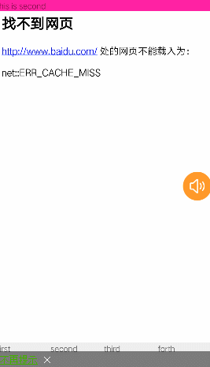

## 介绍
##### 支持单Activity ＋ 多Fragment，多模块Activity + 多Fragment，封装常用方法，解决事务相关等问题

## Demo演示：


## 如何使用
###### 1、Activity继承SupportActivity
```
public class FragmentTabActivity extends SupportActivity {
    public static final String TEMP_FRAGMENT = "temp_fragment";
    private SupportFragment tempFragment;

    @Override
    protected void onCreate(Bundle savedInstanceState) {
        super.onCreate(savedInstanceState);
        setContentView(R.layout.activity_fragment_tab);

        initView();
        initLogic();

        if (savedInstanceState != null) {
            String tempTag = savedInstanceState.getString(TEMP_FRAGMENT);
            if (!TextUtils.isEmpty(tempTag)) {
                tempFragment = (SupportFragment) getSupportFragmentManager().findFragmentByTag(tempTag);
            }
        } else {
            tempFragment = loadRootFragment(R.id.fl_content, new FirstFragment());
        }
    }
}
```

###### 2、Fragment继承SupportFragment
```
public class RegisterFragment extends SupportFragment {

}
```

#### 做好以上两步后就可以使用了

## 方法说明
###### 1、loadRootFragment(int containId, SupportFragment fragment)
###### 加载根视图，进入Activity时第一个加载的Fragment使用该方法，该方法不会创建转场动画

###### 2、showHideFragment(int containId, SupportFragment showFragment, SupportFragment hideFragment)
###### 显示隐藏Fragment

###### 3、addFragment(int containId, SupportFragment fragment)
###### add方式加载Fragment,加入回退栈，默认设置转场动画

###### 4、replaceFragment(int containId, SupportFragment fragment)
###### replace方式加载Fragment,加入回退栈，默认设置转场动画

###### 5、replaceChildFragment(int containId, SupportFragment childFragment)
###### Fragment中加载Fragment使用这个方法，不加回退栈，不支持回退效果

###### 6、popBackStack()
###### 返回到上一个Fragment

###### 7、popBackStack(int count)
###### 回退指定数量的Fragment

###### 8、findFragmentByTag(String tag)
###### 根据指定tag找到Fragment,若是add，replace，tag来源是Fragment的uniqueTag参数；若是show，hide，tag来源是Fragment的类名

###### 9、List<SupportFragment> getFragmentStack()
###### 获取当前栈集合

###### 10、getStackSize()
###### 获取栈中Fragment的数量

###### 11、backToRoot()
###### 回退到根Fragment

## 其它说明
#### 1、自定义动画，有两种方式
###### （1）重写Fragment的getAnimationForAdd和getAnimationForPop方法
###### （2）重写Fragment的onCreateAnimation方法

#### 2、自定义处理back事件
```
@Override
    public boolean interceptBackPress() {
        return true;
    }

    @Override
    protected void dealCustomBack() {
        super.dealCustomBack();
        new AlertDialog.Builder(activity).setMessage("这是拦截Fragment的back按键，点击确定返回上一个Fragment").setPositiveButton("确定", new DialogInterface.OnClickListener() {
            @Override
            public void onClick(DialogInterface dialog, int which) {
                popBackStack();
            }
        }).create().show();
    }
```
###### interceptBackPress返回true，则不会走默认的回退方法了，然后在dealCustomBack方法中做自己的处理